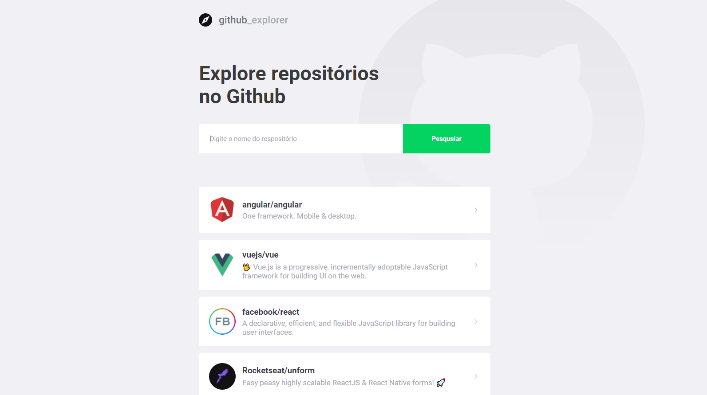

# App created using [Create React App](https://github.com/facebook/create-react-app).
 

* It allows you to select repositories on github to keep them all in the same page.

* The repositories are stored on your browser's cache.  

* Built using [api.github.com](https://api.github.com/).  

**Clone this repo and `npm install / start` to see React at its simplest =)**