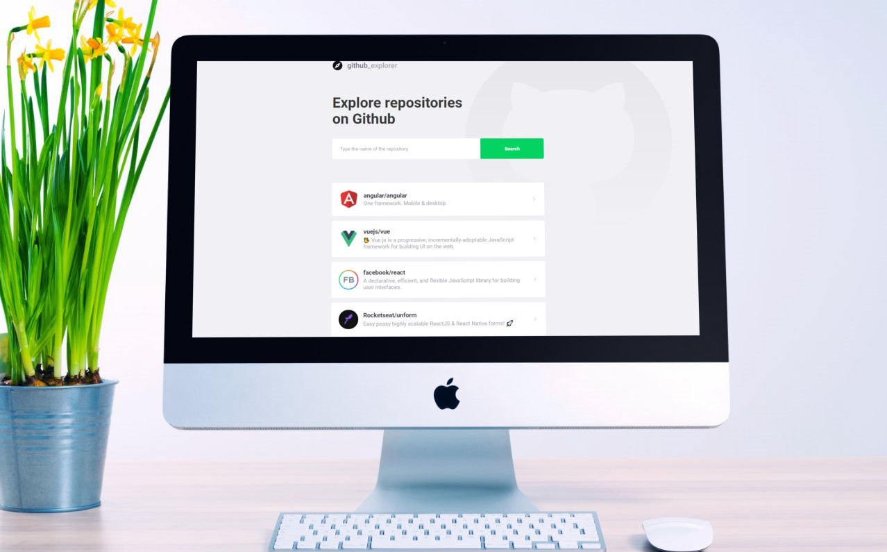

<h1 align="center">
    
</h1>

  <a href="#-technologies">Technologies</a>&nbsp;&nbsp;&nbsp;|&nbsp;&nbsp;&nbsp;
  <a href="#-project">Project</a>&nbsp;&nbsp;&nbsp;|&nbsp;&nbsp;&nbsp;
  <a href="#memo-license">License</a>

 

  

  

 

  

## 🚀 Technologies

This project was developed with the following technologies:

- [React](https://reactjs.org)
- [Styled-components](https://styled-components.com/)
- [Typescript](https://www.typescriptlang.org/)
- [React-icons](https://react-icons.github.io/react-icons/)
- [Polished](https://polished.js.org/)
- [GitHub API](https://docs.github.com/en/free-pro-team@latest/rest)

## 💻 Project

This project allows you to select repositories on github and browse through their main information.

## :memo: License

This project is under MIT license. See [LICENSE](LICENSE.md) for more details.

---

Made with ♥ by Cassio Groh :wave: &nbsp;[See my linkedin](https://www.linkedin.com/in/cassiogroh/)

**Clone this repo and `yarn install / start` to see React at its simplest =)**